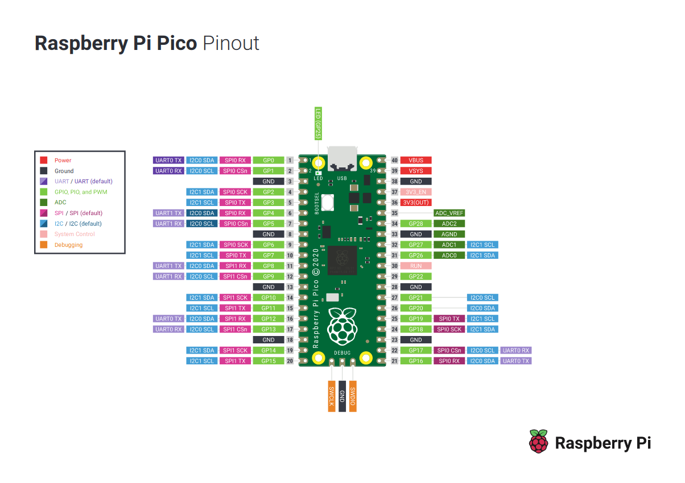

# Raspberry Pi Pico Workshop

## [Workshop Presentation](https://docs.google.com/presentation/d/10UlFPzljGfi0L2pcKjVzTPjJ5C-snwKU/edit?usp=sharing&ouid=106952776417038251910&rtpof=true&sd=true)

## Table of Contents

### [General Purpose Input/Output (GPIO)](workshop/gpio/)
### [Universal Asynchronous Receiver Transmitter (UART)](workshop/uart/)
### [Pulse Width Modulation (PWM)](workshop/pwm/)
### [Analog to Digital Converter](workshop/adc/)

