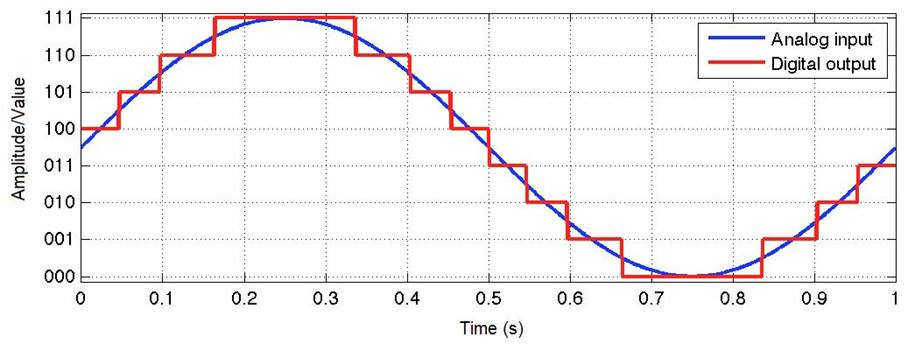

# Analog to Digital Converter (ADC)

Analog to digital converter (ADC) allow communication with the real world. Analog signals have continuously changing values which can measure sound, light, temperatures, and various other sources using sensors. 
 
An ADC will first sample & hold a current analog reading then it will quantize the analog sample, finally it will encode the quantized same.

<p align="center">

</p>


<p align="center">

</p>

## class `ADC`

Initialization of a `ADC` object is done when declaring it. The default constructor's signature can be seen below.

```python
def __init__(self, pin: Union[int, Pin], /):
    """
    Access the ADC associated with a source identified by *id*.  This
    *id* may be an integer (usually specifying a channel number), a
    :ref:`Pin <machine.Pin>` object, or other value supported by the
    underlying machine.
    """
```

###  `ADC` Class Functions

Below are the functions defined for the `ADC` class.
 Note that only one function is implemented for the RP-RP2.

```python
# Not supported on RP-RP2
def init(*, sample_ns, atten) -> None:
    """
    Apply the given settings to the ADC. Only those arguments that are specified will be changed. See the ADC constructor above for what the arguments are.
    """

# Not supported on RP-RP2
def block(self) -> ADCBlock:
    """
    Return the ADCBlock instance associated with this ADC object.
    This method only exists if the port supports the ADCBlock class.
    """

def read_u16(self) -> int:
    """
    Take an analog reading and return an integer in the range 0-65535.
    The return value represents the raw reading taken by the ADC, scaled
    such that the minimum value is 0 and the maximum value is 65535.
    """

# Not supported on RP-RP2
def read_uv(self) -> int:
    """
    Take an analog reading and return an integer value with units of microvolts. It is up to the particular port whether or not this value is calibrated, and how calibration is done.
    """
```

## Demonstration
This section will show a on-board demonstration of using the `PWM` class. This demo will involve controlling a servo using a PWM signal.  
  
Wire your breadboards with the RP-RP2 to resemble the wiring diagram bellow.


### Follow the link and upload the code to your RP-RP2: [adc_demo.py](adc_demo.py)
