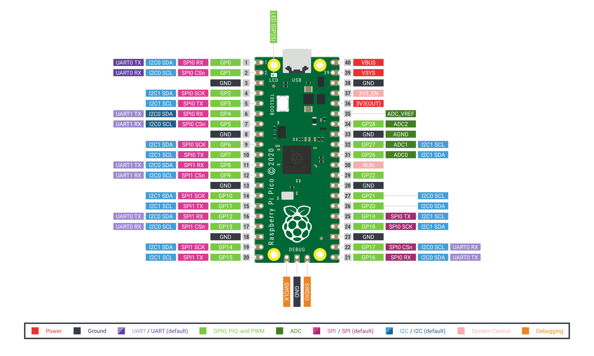

# General Purpose Input/Output
## Introduction
### class `Pin`

A pin object is used to control ***general purpose input/output*** (GPIO) pins. `Pin` objects are associated with physical pins on the RP-RP2 as seen in the pin-out diagram.

<p align="center">
    
    <br> <b> Raspberry Pi Pico Pinout </b>
</p>

### Initializing A `Pin` Object

Initialization of a `Pin` object is done when declaring it. The default constructor's signature can be seen below.

```python
def __init__(self, id: Union[int, str], /, mode: int = IN, pull: int = PULL_UP, af: Union[str, int] = -1):
         """
         Create a new Pin object associated with the id.  If additional arguments are given,
         they are used to initialise the pin.  See :meth:`pin.init`.
         """
```

Below is an example of creating a instance of a `Pin` object at GP0 as an input while being pulled down.

```python
from machine import Pin
...
pin = Pin(0, mode.Pin.IN, pull=Pin.PULL_DOWN)
```

### `Pin` Class Attributes
Bellow are the class attributes of the `Pin` object available on the RP-RP2.

```python
class Pin:
    ...
    ALT = 3
    IN = 0
    IRQ_FALLING = 4
    IRQ_RISING = 8
    OPEN_DRAIN = 2
    OUT = 1
    PULL_DOWN = 2
    PULL_UP = 1
    ... 
```

They are accessed in the following way: `Pin.IRQ_FALLING`

### `Pin` Class Functions

Bellow are the functions defined for the `Pin` class for the RP-RP2.

```python
def high(self):
    """
    Sets the pin to high.
    """

def init(self):
    """
    Initialises the pin.
    """

def irq(self, handler: Callable, trigger: int, hard: bool = False) -> Callable:
    """
    Sets an interrupt for when the pin is rising or falling.

        - ``handler`` the code to execute when the interrupt happens.
        - ``trigger`` either ``IRQ_RISING`` or ``IRQ_FALLING``
        - ``hard`` if true a hardware interrupt is used. This reduces the delay between the pin change and the handler being called.
    """

def low(self):
    """
    Sets the pin to low.
    """

def off(self):
    """
    Sets the pin to be off.
    """

def on(self):
    """
    Sets the pin to be on.
    """

def toggle(self):
    """
    Sets the pin to high if it's currently low, and vice versa.
    """

@overload
def value(self) -> int:
    """
    Get or set the digital logic level of the pin:

        - With no argument, return 0 or 1 depending on the logic level of the pin.
        - With ``value`` given, set the logic level of the pin.  ``value`` can be
        anything that converts to a boolean.  If it converts to ``True``, the pin
        is set high, otherwise it is set low.
    """

@overload
def value(self, value: Any, /) -> None:
    """
    Get or set the digital logic level of the pin:

        - With no argument, return 0 or 1 depending on the logic level of the pin.
        - With ``value`` given, set the logic level of the pin.  ``value`` can be
        anything that converts to a boolean.  If it converts to ``True``, the pin
        is set high, otherwise it is set low.
    """

```

### `Pin` Objects & Interrupts

Their are two ways of reading data from the GPIOs: polling and interrupts. It is up to the embedded programmer to decided which to use per application.

## Polling

Polling is the act of periodicity checking the GPIO pin(s) to grab data. Polling is effective when the data is frequently and deterministic. It becomes ineffective when the data is aperiodic/infrequent as it leaves the CPU doing nothing when no data is present.

## Interrupts

Interrupts allow the CPU to continues doing other task, when a *trigger* is detected in a specific pin, the CPU will stop it current task and *handler* the interrupt cause.

The `Pin` class allow the setting of interrupts (IRQ) for each GPIO pin using the ```irq(...)``` function defined above.

The ``irq(...)`` functions requires three things:
- `handler` : a function that is called whenever the interrupt occurs.
- `trigger` : event that cause the interrupt, only two options `IRQ_FALLING` and `IRQ_RISING`.
- `hard`    : if true enables a hardware interrupt which is quicker to call the ***interrupt service routine*** (ISR).

Bellow is an example of an interrupt that occurs whenever a falling edge is detected on GP0:

```python
from machine import Pin
...
def pin_isr(callback: Pin):
    ...

pin = Pin(0, mode.Pin.IN, pull=Pin.PULL_UP)
pin.irq(callback=pin_isr, trigger=Pin.IRQ_FALLING, hard=True)
```

## Demonstration

This section will show a on-board demonstration of using the `Pin` class along with interrupts.

Wire your breadboard with the RP-RP2 and push buttons to resemble the wiring diagram bellow.


Following the link and upload the code to your RP-RP2: [python_demo.py](gpio_demo.py)

