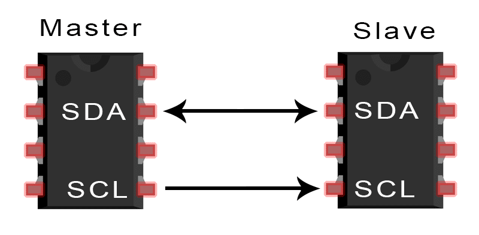
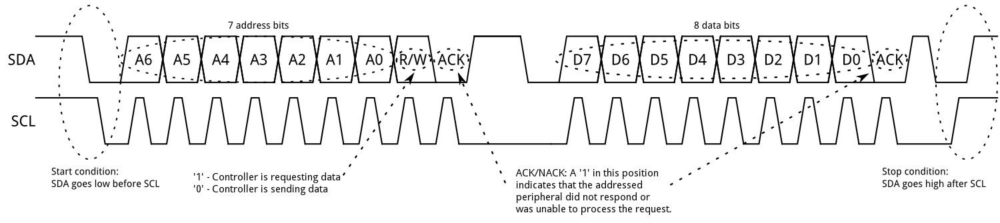
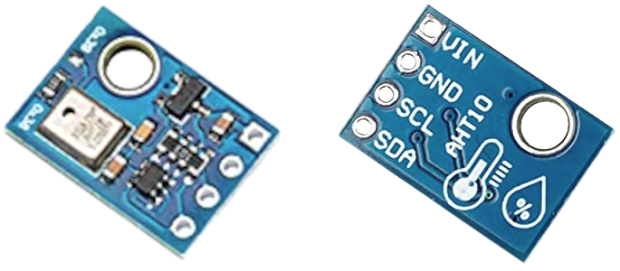

# Inter-Integrated Circuit (I<sup>2</sup>C)

Inter-Integrated Circuit (I<sup>2</sup>C), also known as I2C, is a bus interface connection protocol that is incorporated into devices for serial communication. This protocol is used to connect microcontrollers, EEPROMS, converters and I/O interfaces in embedded systems. It allows for short-distance communication among devices.

The I2C has two bi-direction lines for data communication called <b>SDA</b> and <b>SCL</b>.

<b>SDA</b>
<br>
The Serial Clock, SCL, carries the clock signal.

<b>SCL</b>
<br>
The Serial Data, SDA, is where the transfer of data occurs.

Alongside the SCL and SDA, there are two operating modes.
<ul>
    <li> <b>Master</b> - SCL resides here.
    <li> <b>Slave</b> - Has bidirectional SDA communication with Master
</ul>

<p align="center">

</p>

The way I2C devices communicate is demonstrated below.

<p align="center">
    
    <br> <b> I2C Handshake</b>
</p>

## class `I2C`

Initialization of a `I2C` object is done when declaring it. The default constructor's signature can be seen below.

```python
   @overload
   def init(self, *, scl: Pin, sda: Pin, freq: int = 400_000) -> None:
      """
     Initialise the I2C bus with the given arguments:
   
        - *scl* is a pin object for the SCL line
        - *sda* is a pin object for the SDA line
        - *freq* is the SCL clock rate
      """
```

The pinout below shows the GPIO pins that are attached to the I2C controller on the Raspberry Pi Pico.

<p align="center">

</p>

### `I2C` Class Functions

The `I2C` functions implements are list below.

```python
def scan(self) -> List[int]:
    """
    Scan all I2C addresses between 0x08 and 0x77 inclusive and return a list of
    those that respond.  A device responds if it pulls the SDA line low after
    its address (including a write bit) is sent on the bus.
    """

def start(self) -> None:
    """
    Generate a START condition on the bus (SDA transitions to low while SCL is high).
    """

def stop(self) -> None:
    """
    Generate a STOP condition on the bus (SDA transitions to high while SCL is high).
    """

def readinto(self, buf: bytes, nack: bool = True, /) -> None:
    """
    Reads bytes from the bus and stores them into *buf*.  The number of bytes
    read is the length of *buf*.  An ACK will be sent on the bus after
    receiving all but the last byte.  After the last byte is received, if *nack*
    is true then a NACK will be sent, otherwise an ACK will be sent (and in this
    case the slave assumes more bytes are going to be read in a later call).
    """

def write(self, buf: bytes, /) -> int:
    """
    Write the bytes from *buf* to the bus.  Checks that an ACK is received
    after each byte and stops transmitting the remaining bytes if a NACK is
    received.  The function returns the number of ACKs that were received.
    """

def readfrom(self, addr: int, nbytes: int, stop: bool = True, /) -> bytes:
    """
    Read *nbytes* from the slave specified by *addr*.
    If *stop* is true then a STOP condition is generated at the end of the transfer.
    Returns a `bytes` object with the data read.
    """

def readfrom_into(self, addr: int, buf: bytes, stop: bool = True, /) -> None:
    """
    Read into *buf* from the slave specified by *addr*.
    The number of bytes read will be the length of *buf*.
    If *stop* is true then a STOP condition is generated at the end of the transfer.

    The method returns ``None``.
    """

def writeto(self, addr: int, buf: bytes, stop: bool = True, /) -> int:
    """
    Write the bytes from *buf* to the slave specified by *addr*.  If a
    NACK is received following the write of a byte from *buf* then the
    remaining bytes are not sent.  If *stop* is true then a STOP condition is
    generated at the end of the transfer, even if a NACK is received.
    The function returns the number of ACKs that were received.
    """

def writevto(self, addr: int, vector: Sequence[bytes], stop: bool = True, /) -> int:
    """
    Write the bytes contained in *vector* to the slave specified by *addr*.
    *vector* should be a tuple or list of objects with the buffer protocol.
    The *addr* is sent once and then the bytes from each object in *vector*
    are written out sequentially.  The objects in *vector* may be zero bytes
    in length in which case they don't contribute to the output.

    If a NACK is received following the write of a byte from one of the
    objects in *vector* then the remaining bytes, and any remaining objects,
    are not sent.  If *stop* is true then a STOP condition is generated at
    the end of the transfer, even if a NACK is received.  The function
    returns the number of ACKs that were received.
    """

def readfrom_mem(self, addr: int, memaddr: int, nbytes: int, /, *, addrsize: int = 8) -> bytes:
    """
    Read *nbytes* from the slave specified by *addr* starting from the memory
    address specified by *memaddr*.
    The argument *addrsize* specifies the address size in bits.
    Returns a `bytes` object with the data read.
    """

def readfrom_mem_into(self, addr: int, memaddr: int, buf: bytes, /, *, addrsize: int = 8) -> None:
    """
    Read into *buf* from the slave specified by *addr* starting from the
    memory address specified by *memaddr*.  The number of bytes read is the
    length of *buf*.
    The argument *addrsize* specifies the address size in bits (on ESP8266
    this argument is not recognised and the address size is always 8 bits).

    The method returns ``None``.
    """

def writeto_mem(self, addr: int, memaddr: int, buf: bytes, /, *, addrsize: int = 8) -> None:
    """
    Write *buf* to the slave specified by *addr* starting from the
    memory address specified by *memaddr*.
    The argument *addrsize* specifies the address size in bits (on ESP8266
    this argument is not recognised and the address size is always 8 bits).

    The method returns ``None``.
    """
```
## Demonstration

This section will show a on-board demonstration of using the `I2C` class to communicate
with an external temperature and humidity sensor (AHT10).

### AHT10 Overview
The AHT10 is equipped with an ASIC chip that communications with temperature and humidity sensors. It uses the I2C protocol to calibrate and read the digital output signals. 

A breakout board equipped with the AHT10 sensor will be used to communicate with the Raspberry Pi Pico to read the temperature and humidity of the atmosphere. The breakout board is shown below.

<p align="center">
    
    <br> <b> AHT10 Breakout Board </b>
</p>
  
We will be making a circuit similar to the diagram below to read the temperature and humidity of the atmosphere.

<p align="center">

<br> <b>Generic Wiring Diagram</b>
</p>

The [datasheet](AHT10_Datasheet.pdf) for the AHT10 will be used for this demo since it has instructions on how to communicate with the AHT10.

Wire your breadboard with the RP-RP2 and push buttons to resemble the wiring diagram below.


### Follow the link and upload the code to your RP-RP2: [i2c_demo.py](../i2c/i2c_demo.py)