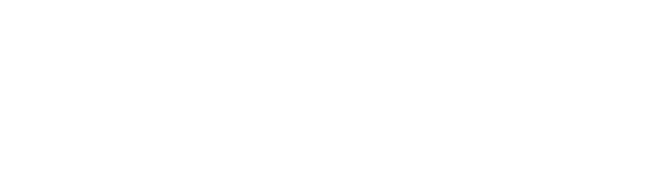
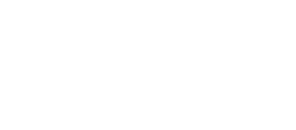
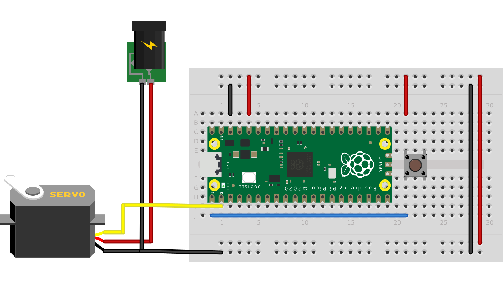

# Pulse Width Modulation (PWM)
Pulse-width modulation (PWM) is a technique for getting analog results using digital means. A controller is used to create a square save signal as seen in the image bellow.
## Introduction
<p align="center">
    
    <br> <b> Digital Signal </b>
</p>

By varying the portion of the time the signal is "on" a analog value can be achieved. The image bellow shows who this can be done by varying the ***pulse width*** of a signal. A example of this is the dimming of an LED. PWM signals can also be used to control motor devices like a servo motor or a stepper motor.

<p align="center">
    
    <br> <b> PWM Signal </b>
</p>

   

## class `PWM`

There are 8 independent channels each of which have 2 outputs making it 16 PWM channels in total which can be clocked from 7Hz to 125Mhz. A PWM object can be initialized on any GPIO pin that support PWM as shown in the pinout bellow.

<p align="center">
    
    <br> <b> Raspberry Pi Pico Pinout </b>
</p>

### Initializing A `PWM` Object

Initialization of a `PWM` object is done when declaring it. The default constructor's signature can be seen below.

```python
def __init__(self, pin: Pin):
      """
      Construct and return a new PWM object using the following parameters:

         - *pin* should be the pin to use.
      """
```

Below is an example of creating a instance of a `PWM` object at GP0 and setting a frequency of 50 Hz.

```python
from machine import PWM, Pin
...
pwm = PWM(Pin(1))
pwm.freq(50)
```

### `PWM` Class Functions
Bellow are the functions defined for the `PWM` class for the RP-RP2.

```python
def deinit(self) -> None:
         """
         Disable the PWM output.
         """
         
def freq(self, frequency: Optional[int]):
    """
    With no arguments the frequency in Hz is returned.

    With a single *value* argument the frequency is set to that value in Hz.  The method may raise a ``ValueError`` if the frequency is outside the valid range.
    """

def duty_u16(self, duration: Optional[int]):
    """
    Get or Set the current duty cycle of the PWM output, as an unsigned 16-bit value in the range 0 to 65535 inclusive.

    With no arguments the duty cycle is returned.

    With a single *value* argument the duty cycle is set to that value, measured as the ratio ``value / 65535``.
    """

def duty_ns(self, duration: Optional[int]):
    """
    Get or Set the current pulse width of the PWM output, as a value in nanoseconds.

    With no arguments the pulse width in nanoseconds is returned.

    With a single *value* argument the pulse width is set to that value.
    """
```

## Demonstration
This section will show a on-board demonstration of using the `PWM` class. This demo will involve controlling a servo using a PWM signal.  
  
Wire your breadboards with the RP-RP2 to resemble the wiring diagram bellow.

 

### Follow the link and upload the code to your RP-RP2: [pwm_demo.py](pwm_demo.py)