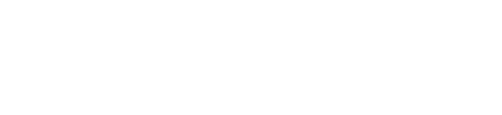
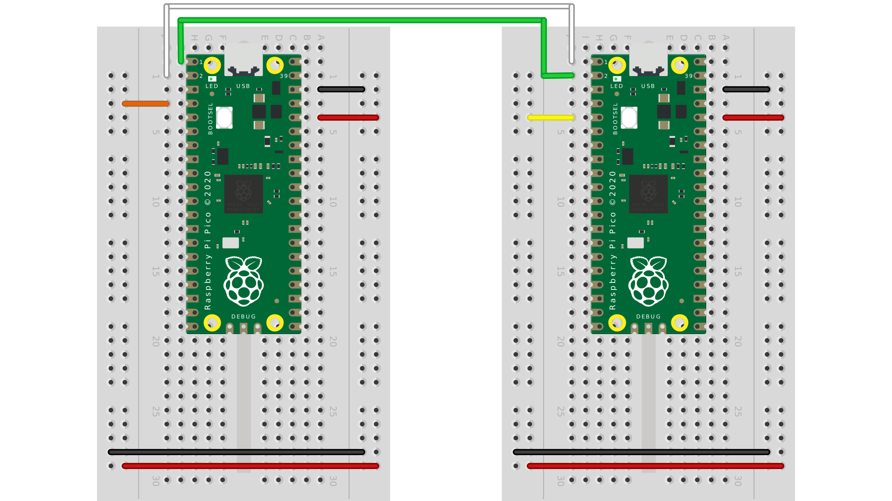

# Universal Asynchronous Receiver Transmitter (UART)

## Introduction
Universal asynchronous receiver transmitter (UART) is a serial commination protocol that is used to communicate between any two devices.
It is an asynchronous protocol, therefore is has no need for a clock. It utilizes only two connections to function. UART delivers a message using a 11/12 bit packet. The frame can be seen bellow.

<p align="center">

<br> <b> UART Frame </b>
</p>

When design a application that utilizes UART the following parameters must be considered:
- `BAUD` rate
- `START` bit
- `DATA` byte
- `PARITY` bit (optional)
- `STOP` bit

## class `UART`

The `UART` class implements the standard UART/USART duplex serial communications protocol. The protocol consists of 2 lines: RX and TX. The RP-RP2 has two UART interfaces (`UART0` & `UART1`). They can be accessed using the GPIO pins labeled with UART(0/1) TX and UART(0/1) RX. Currently only one UART can be used at a time.

<p align="center">
    
    <br> <b> Raspberry Pi Pico Pinout </b>
</p>

### Initializing A `UART` Object

Initialization of a `UART` object is done when declaring it. The default constructor's signature can be seen below.

```python
def __init__(self, id: int, baudrate: int=9600, bits: int=8, parity: int=None, stop: int=1, tx: Pin=None, rx: Pin=None):
    """
    Construct a UART object of the given id and initialise the UART 
    bus with the given parameters:

    - *baudrate* is the clock rate.
    - *bits* is the number of bits per character, 7, 8 or 9.
    - *parity* is the parity, ``None``, 0 (even) or 1 (odd).
    - *stop* is the number of stop bits, 1 or 2.
    - *tx* specifies the TX pin to use.
    - *rx* specifies the RX pin to use.
   """
```
Below is an example of creating a instance of a `UART` object at GP0 and GP1.

```python
from machine import UART, Pin
...
uart0 = UART(id=0, baudrate=BAUD, stop=STOP_BITS, tx=Pin(0), rx=Pin(1))
```
### `Pin` Class Functions
Bellow are the functions defined for the `UART` class for the RP-RP2.

```python
def any(self) -> int:
      """
      Returns the number of bytes waiting (may be 0).
      """

@overload
def read(self) -> Optional[bytes]:
    """
    Read characters.  If ``nbytes`` is specified then read at most that many bytes.
    If ``nbytes`` are available in the buffer, returns immediately, otherwise returns
    when sufficient characters arrive or the timeout elapses.

    If ``nbytes`` is not given then the method reads as much data as possible.  It
    returns after the timeout has elapsed.

    *Note:* for 9 bit characters each character takes two bytes, ``nbytes`` must
    be even, and the number of characters is ``nbytes/2``.

    Return value: a bytes object containing the bytes read in.  Returns ``None``
    on timeout.
    """

@overload
def read(self, nbytes: int, /) -> Optional[bytes]:
    """
    Read characters.  If ``nbytes`` is specified then read at most that many bytes.
    If ``nbytes`` are available in the buffer, returns immediately, otherwise returns
    when sufficient characters arrive or the timeout elapses.

    If ``nbytes`` is not given then the method reads as much data as possible.  It
    returns after the timeout has elapsed.

    *Note:* for 9 bit characters each character takes two bytes, ``nbytes`` must
    be even, and the number of characters is ``nbytes/2``.

    Return value: a bytes object containing the bytes read in.  Returns ``None``
    on timeout.
    """

@overload
def readinto(self, buf: bytes, /) -> Optional[int]:
    """
    Read bytes into the ``buf``.  If ``nbytes`` is specified then read at most
    that many bytes.  Otherwise, read at most ``len(buf)`` bytes.

    Return value: number of bytes read and stored into ``buf`` or ``None`` on
    timeout.
    """

@overload
def readinto(self, buf: bytes, nbytes: int, /) -> Optional[int]:
    """
    Read bytes into the ``buf``.  If ``nbytes`` is specified then read at most
    that many bytes.  Otherwise, read at most ``len(buf)`` bytes.

    Return value: number of bytes read and stored into ``buf`` or ``None`` on
    timeout.
    """

def readline(self) -> Optional[str]:
    """
    Read a line, ending in a newline character. If such a line exists, return is
    immediate. If the timeout elapses, all available data is returned regardless
    of whether a newline exists.

    Return value: the line read or ``None`` on timeout if no data is available.
    """

def write(self, buf: bytes, /) -> Optional[int]:
    """
    Write the buffer of bytes to the bus.  If characters are 7 or 8 bits wide
    then each byte is one character.  If characters are 9 bits wide then two
    bytes are used for each character (little endian), and ``buf`` must contain
    an even number of bytes.

    Return value: number of bytes written. If a timeout occurs and no bytes
    were written returns ``None``.
    """

def sendbreak(self) -> None:
    """
    Send a break condition on the bus.  This drives the bus low for a duration
    of 13 bits.
    Return value: ``None``.
    """
```

## Demonstration

This section will show a on-board demonstration of using the `UART` class. This demo will require the pairing up of two separate RP-RP2.
Wire your breadboards with the RP-RP2 to resemble the wiring diagram bellow.


### Follow the link and upload the code to your RP-RP2: [uart_demo.py](uart_demo.py)
